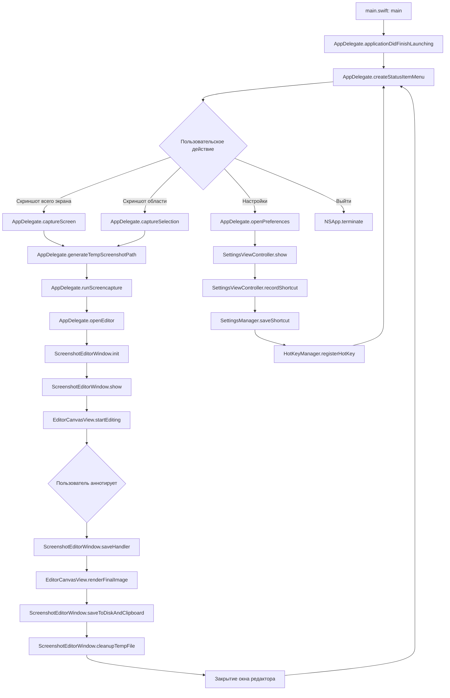

# Диаграмма потока работы Vibe Screenshoter (Mermaid)



## Легенда
- Каждый блок — это конкретный метод или функция из кода.
- Ветка E/F — полный и частичный скриншот, далее логика схожа.
- Ветка настроек отражает работу с хоткеями и настройками.
```
